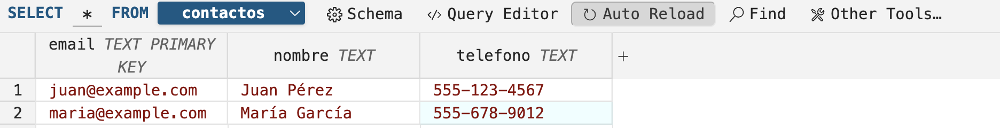

# Evaluación de conocimientos de API REST

## 1. Tickets a corregir

|no|Descripción|Terminado (S/N)|
|--|--|--|
|1.|Utilizar el script contactos.sql para crear una tabla en sqlite3 de nombre contactos.db|s/n|
|2.|Corregir el método para insetar un contacto nuevo|s/n|
|3.|Corregir el método para mostrar tdoos los contactos|s/n|
|4.|Corregir el método para consultar un contacto por email|s/n|
|5.|Corregir el método para actualizar un contacto basado en su email|s/n|
|6.|Corregir el método para borrar un contacto basado en su email|s/n|

## 2. Evidencias

|no|Descripción|Evidencia|
|--|--|--|
|1.|Utilizar el script contactos.sql para crear una tabla en sqlite3 de nombre contactos.db|{width=100 height=100}|
|2.|Corregir el método para insetar un contacto nuevo|{width=100 height=100}|
|3.|Corregir el método para mostrar tdoos los contactos|{width=100 height=100}|
|4.|Corregir el método para consultar un contacto por email{width=100 height=100}|
|5.|Corregir el método para actualizar un contacto basado en su email|{width=100 height=100}|
|6.|Corregir el método para borrar un contacto basado en su email|{width=100 height=100}|